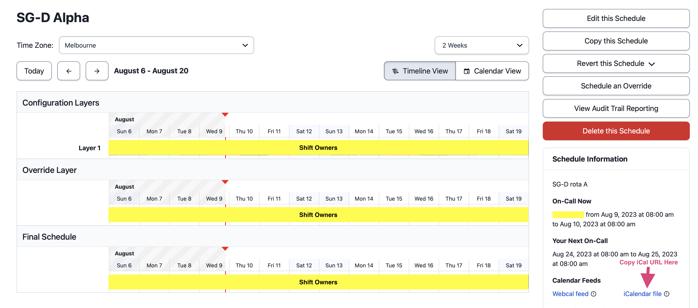

# PagerDuty Schedule Exporter
This solves one problem and one problem only, which is to take an export of PD schedule start, end times along with the owner.

# Usage

Download [latest release here](https://github.com/purinda/pagerduty-schedule-export/releases/latest) as per your system and run `--help` to view usage information.

```
./pd-export --help

Usage of ./pd-export:
  -timezone float
    Timezone offset in hours from UTC.
  -url string
    URL to fetch the iCal data from.
```

### Example Usage

```sh
./pd-export -timezone=10.5 -url=https://yourdomain.pagerduty.com/private/8e4da5810dXXXXXX05137006f2a05caf226711e935591089cf2b74cac1c4/feed/A2UH2X5

Data written to A2UH2X5.csv
```

### How to Retrieve the PagerDuty iCal URL

Navigate to the PD schedule page and copy the URL as per screenshot.



## Building

Prerequisites - Go (at least version 1.16) installed on your computer.

Compile the application:
```sh
go build -o app .
```

Run the compiled binary:
```sh
./app [arguments]
```

## Testing
To run the unit tests for the application

```sh
go test
```